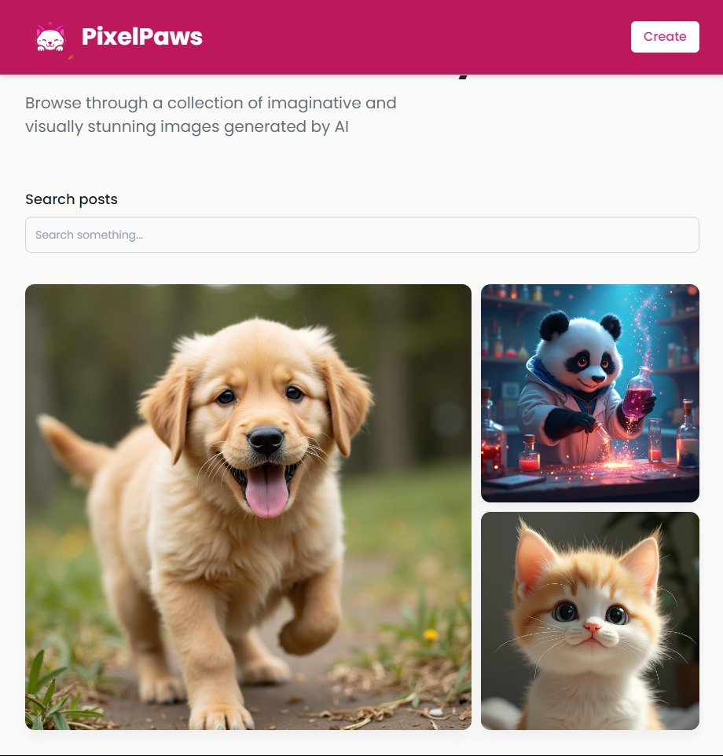

# PixelPaws - AI-Powered Image Generation

Welcome to PixelPaws, an AI-powered image generation application that allows users to create imaginative images using AI and share them with the community.



## Table of Contents

- Features
- Installation
- Usage
- Contributing
- License
- Contact

## Features

- **AI-Powered Image Generation**: Generate unique and imaginative images using DALL-E AI.
- **Surprise Me**: Get random prompts to inspire your creativity.
- **Share with Community**: Share your generated images with the community.
- **Responsive Design**: Enjoy a seamless experience on both desktop and mobile devices.

## Installation

To get started with PixelPaws, follow these steps:

1. **Clone the repository**:

   ```sh
   git clone https://github.com/KetanKumavat/PixelPaws_WP-Project.git
   cd PixelPaws_WP-Project
   ```

2. **Install dependencies**:

   ```sh
   npm install
   ```

3. **Start the development server**:

   ```sh
   npm start
   ```

4. **Backend Setup**:

   Ensure you have the backend server running on `http://localhost:5000`. You can find the backend repository here.

## Environment Setup

To set up the environment variables, create a `.env` file in the server folder and add the following:

```env
# .env file in the server folder

HUGGINGFACE_TOKEN="your_huggingface_token"
MONGODB_URL="your_mongodb_url"
PORT=5000
CLOUDINARY_CLOUD_NAME="your_cloudinary_cloud_name"
CLOUDINARY_API_KEY="your_cloudinary_api_key"
CLOUDINARY_API_SECRET="your_cloudinary_api_secret"
```

Replace the placeholder values with your actual API keys and URLs.

## Usage

1. **Navigate to the Home Page**: Open your browser and go to `http://localhost:5173`.
2. **Create a Post**: Click on the "Create" button to generate a new image.
3. **Generate Image**: Enter a prompt or use the "Surprise Me" button to get a random prompt. Click "Generate" to create an image.
4. **Share with the Community**: Once the image is generated, click "Share with the Community" to post it.

## Contributing

We welcome contributions to PixelPaws! To contribute, follow thes e steps:

1. **Fork the repository**.
2. **Create a new branch**:

   ```sh
   git checkout -b feature/your-feature-name
   ```

3. **Make your changes**.
4. **Commit your changes**:

   ```sh
   git commit -m 'Add some feature'
   ```

5. **Push to the branch**:

   ```sh
   git push origin feature/your-feature-name
   ```

6. **Open a pull request**.

## Contact

If you have any questions or feedback, feel free to reach out:

- **Ketan Kumavat** - [GitHub](https://github.com/KetanKumavat)
